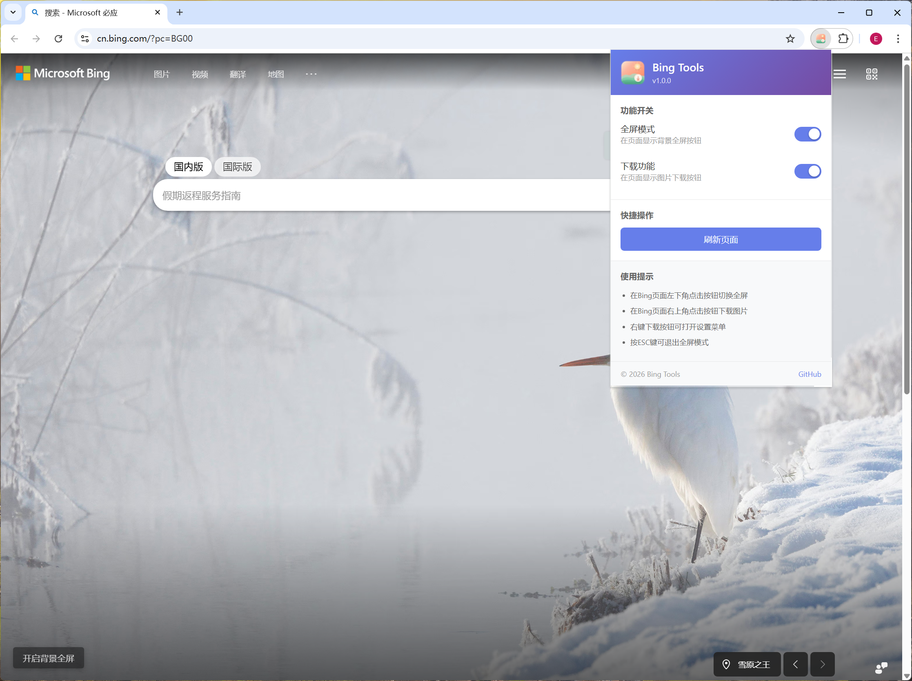
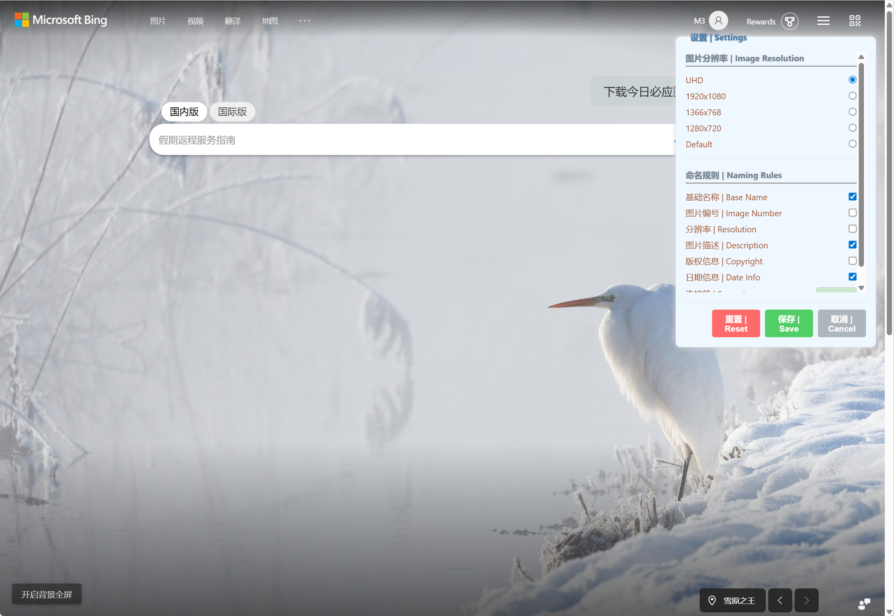

# Bing Tools 浏览器插件安装与使用说明

## 一、插件简介

**插件名称**：Bing Tools（必应工具箱）  
**版本**：v1.0.0  
**适用平台**：Microsoft Bing 搜索页面  
**支持语言**：中文、英文、日文、韩文、法文

### 主要功能

Bing Tools 是一款专为 Microsoft Bing 搜索引擎设计的浏览器增强插件，提供以下核心功能：

1. **全屏模式** — 一键将 Bing 首页背景图片切换为全屏显示，沉浸式欣赏每日美图
2. **图片下载** — 快速下载必应每日背景图片，支持自定义分辨率和文件名格式
3. **个性化设置** — 灵活配置图片命名规则、分辨率选项等

---

## 二、安装步骤

### 方法一：开发者模式安装（推荐）

#### 步骤 1：获取插件文件
- 下载 `bing-tools-extension.zip` 文件
- 将压缩包解压到本地文件夹（如 `D:\BingTools`）
-  `bing-tools-extension.zip` 压缩包文件可留做备份，以便重新安装使用

#### 步骤 2：打开 Chrome 扩展管理页面
1. 打开 Chrome 浏览器
2. 在地址栏输入 `chrome://extensions/` 并回车
3. 或者点击菜单（右上角三个点）→ 更多工具 → 扩展程序

#### 步骤 3：开启开发者模式
- 在扩展管理页面右上角，找到"开发者模式"开关
- 将开关切换为**开启**状态（蓝色）

#### 步骤 4：加载插件
1. 点击页面左上角的"加载已解压的扩展程序"按钮
2. 在弹出的文件选择对话框中，选择刚才解压的插件文件夹
3. 点击"选择文件夹"按钮

#### 步骤 5：确认安装成功
- 页面会显示 "Bing Tools" 插件卡片
- 浏览器工具栏会出现 Bing Tools 的图标（拼图形状或插件图标）
- 如果没有显示图标，点击工具栏的拼图图标，将 Bing Tools 固定到工具栏

### 方法二：拖拽安装（.crx 格式）（旧版本安装方式，不推荐）

> 注意：新版 Chrome 已限制此方式，建议使用方法一

1. 获取 `.crx` 格式的插件文件
2. 打开 `chrome://extensions/` 页面
3. 开启"开发者模式"
4. 将 `.crx` 文件拖拽到扩展管理页面
5. 点击"添加扩展程序"确认安装

---

## 三、使用方法

### 3.1 打开插件主界面

点击浏览器工具栏上的 **Bing Tools 图标**，即可打开插件弹出窗口：

弹出窗口包含以下区域：

#### 功能开关区
- **全屏模式**：控制是否在 Bing 页面显示"开启背景全屏"按钮
- **下载功能**：控制是否在 Bing 页面显示"下载今日必应图片"按钮

> 提示：开关为蓝色表示功能已启用，灰色表示已禁用

#### 快捷操作区
- **刷新页面**：点击后自动刷新当前 Bing 页面，使设置生效

#### 使用提示区
显示当前功能的快捷操作说明：
- 在 Bing 页面左下角点击按钮切换全屏
- 在 Bing 页面右上角点击按钮下载图片
- 右键下载按钮可打开设置菜单
- 按 ESC 键可退出全屏模式

---

### 3.2 全屏模式使用

#### 进入全屏
1. 确保"全屏模式"开关已开启
2. 访问 Bing 首页（`https://www.bing.com`）
3. 在页面**左下角**找到"**开启背景全屏**"按钮
4. 点击按钮，页面将切换为全屏显示模式

#### 退出全屏
- **方法一**：点击屏幕上的"退出背景全屏"或"退出全部全屏"按钮
- **方法二**：按键盘上的 **ESC** 键
- **方法三**：再次点击左下角的全屏切换按钮

#### 全屏模式效果
- Bing 首页背景图片将铺满整个屏幕
- 隐藏搜索框、导航栏等页面元素
- 沉浸式欣赏高清背景图片

---

### 3.3 图片下载功能使用

#### 快速下载
1. 确保"下载功能"开关已开启
2. 访问 Bing 首页
3. 在页面**右上角**找到"**下载今日必应图片**"按钮
4. 点击按钮即可下载当前背景图片

#### 自定义下载设置

如需调整下载参数，可打开设置菜单：

1. **右键点击**"下载今日必应图片"按钮
2. 弹出设置菜单窗口：

##### 图片分辨率设置
选择下载图片的清晰度：
- **UHD**（超高清）：最高分辨率，文件最大
- **1920x1080**：全高清，适合电脑壁纸
- **1366x768**：标准高清
- **1280x720**：高清
- **Default**：使用 Bing 默认分辨率

> 建议：如需用作电脑壁纸，推荐选择 UHD 或 1920x1080

##### 命名规则设置
自定义下载文件的命名格式，可勾选以下元素：

| 选项 | 说明 | 示例 |
|------|------|------|
| 基础名称 | 图片的基础标识名 | `SnowyEgret` |
| 图片编号 | Bing 图片的内部编号 | `ZH-CN` |
| 分辨率 | 图片尺寸信息 | `1920x1080` |
| 图片描述 | 图片的中文描述 | `雪鹭` |
| 版权信息 | 图片版权说明 | `© Getty Images` |
| 日期信息 | 图片发布日期 | `2026-02-23` |
| 连接符 | 各元素之间的分隔符号 | `_`、`-`、`.` 等 |

**文件名示例**：
- 勾选"基础名称 + 日期信息"，连接符选"_"：
  - 文件名：`SnowyEgret_2026-02-23.jpg`
- 勾选"基础名称 + 图片描述 + 日期"：
  - 文件名：`SnowyEgret_雪鹭_2026-02-23.jpg`

##### 保存设置
- 点击"**保存 | Save**"按钮：保存当前设置并关闭菜单
- 点击"**重置 | Reset**"按钮：恢复默认设置
- 点击"**取消 | Cancel**"按钮：放弃修改并关闭菜单

---

### 3.4 插件设置同步

插件的所有设置（功能开关、下载选项等）会自动保存，下次打开浏览器时仍然有效。

如需让设置立即生效：
1. 修改设置后，点击插件弹出窗口的"**刷新页面**"按钮
2. 或手动按 **F5** 刷新 Bing 页面

---

## 四、界面元素说明

### 4.1 Bing 页面上的插件按钮

| 位置 | 按钮名称 | 功能 |
|------|----------|------|
| 左下角 | 开启背景全屏 | 切换全屏显示模式 |
| 右上角 | 下载今日必应图片 | 下载当前背景图片 |

### 4.2 插件弹出窗口

| 区域 | 元素 | 功能 |
|------|------|------|
| 头部 | Bing Tools 图标和版本 | 显示插件信息 |
| 功能开关 | 全屏模式开关 | 启用/禁用全屏功能 |
| 功能开关 | 下载功能开关 | 启用/禁用下载功能 |
| 快捷操作 | 刷新页面按钮 | 刷新当前页面 |
| 底部 | GitHub 链接 | 访问项目开源页面 |

---

## 五、注意事项

### 5.1 兼容性说明
- **支持浏览器**：Google Chrome、Microsoft Edge（新版）、其他 Chromium 内核浏览器
- **支持页面**：Microsoft Bing 首页（`bing.com` 及其子域名）
- **不支持**：其他搜索引擎页面或非 Bing 网站

### 5.2 使用建议
1. **首次使用**：安装后刷新 Bing 页面，确保插件正常加载
2. **功能失效**：如果按钮未显示，请检查功能开关是否开启，并刷新页面
3. **下载失败**：检查浏览器下载权限，或尝试更换图片分辨率
4. **全屏异常**：按 ESC 键可强制退出全屏模式

### 5.3 常见问题

**Q1：安装后 Bing 页面上没有显示按钮？**
- 检查插件是否已启用（扩展管理页面）
- 检查对应功能的开关是否已打开
- 刷新 Bing 页面

**Q2：下载的图片文件名是乱码？**
- 在设置菜单中调整命名规则选项
- 避免使用特殊字符作为连接符

**Q3：全屏模式无法退出？**
- 按键盘 **ESC** 键强制退出
- 或点击屏幕上的退出按钮

**Q4：插件弹出窗口显示空白？**
- 重新点击工具栏图标打开
- 或重启浏览器后重试

### 5.4 隐私说明
- 本插件仅在 Bing 域名（`*.bing.com`）下运行
- 不会收集或上传任何用户数据
- 所有设置保存在本地浏览器中

---

## 六、更新与反馈

### 检查更新
- 打开 Chrome 扩展管理页面（`chrome://extensions/`）
- 点击"更新"按钮检查插件更新

### 问题反馈
如有问题或建议，可通过以下方式反馈：
- 点击插件弹出窗口底部的"**GitHub**"链接
- 在项目页面提交 Issue

---

## 七、快捷操作汇总

| 操作 | 方式 |
|------|------|
| 打开插件设置 | 点击浏览器工具栏 Bing Tools 图标 |
| 切换全屏模式 | 点击 Bing 页面左下角"开启背景全屏"按钮 |
| 退出全屏模式 | 按 **ESC** 键或点击退出按钮 |
| 下载图片 | 点击 Bing 页面右上角"下载今日必应图片"按钮 |
| 打开下载设置 | 右键点击下载按钮 |
| 刷新页面 | 点击插件弹出窗口的"刷新页面"按钮 |

---

**祝您使用愉快！**
